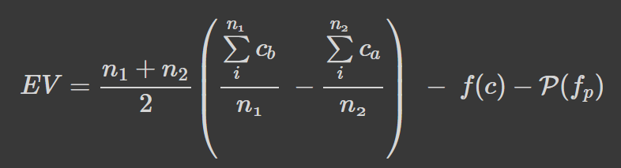

# Quality Of Products
Is it possible to predict defective products before the process or determine which production phases cause defective products, by examining the production process and defective products?

*__Purpose__*:  Goal of this project is to reveal the features of manufacturing that leads to poor quality. Various sensor datum and new produced features are examined with different models to predict defective products. Models and analysis results are examined according to expected value framework. 

### Expected Value Framework

**EV** represents Expected Value and Expected Value equals to difference between Expected Benefit minus Expected Loss

EV represents the expected value and ${f( c)}$ is the cost function of the project. $n$ is the total number of products and $c_{a}$ and $c_{b}$ are the cost of the defective product respectively after the project and before the project. $$ P(f_{p})$$ represents the false positives from the model prediction. If so many false positives are predicted by model, it could be considered as an extra cost for models.

So according to this formula the gap between the total cost of the defective product before the project and after the project must be higher than the cost of the project in order to be profitable.

### Note

This repository is created for a bootcamp practical case given by patika.dev and Vitra. The dataset used in this project is provided by Vitra.

